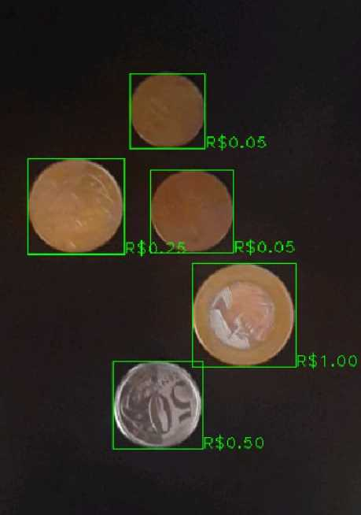

## NOT FINISHED YET! -- need to update scrapper of the currencies. 

## Introduction

Coin Counter is an easy-to-use Android application that can count how much money there is in coins, using the smartphone camera. It also provides a currency-convert calculator.

## Inspiration

This application was designed to make the tedious task of counting coins quicker and less tiring, especially for small commerce, who always receive a lot of them from their clients.  It also intends to help small business owners and costumers not to touch in coins as a measure of preventing the spread of COVID-19.

## What it does

It uses the smartphone camera to identify the value of each coin in an image and displays the sum of them. It also has a currency-convert calculator, where you can fill an amount and an exchange rate, and it returns the conversion result.

## How we built it

Using the Android Studio API, as well as Pytorch, OpenCV and Jsoup.

## Machine Learning

We trained a Convolutional Neural Network model called MobileNetV2, which we download from the Torchvision Python package. This model is more suitable for use in mobile devices, as it optimizes the number of floating-point operations needed for inference. 
To train this model, we created a dataset from scratch ((link: https://www.kaggle.com/ronaldosm96/brazilian-coins-dataset)) and labeled all images using the software Colabeler (Link: http://www.colabeler.com/).

| Precision  | Recal |
| ---        |  ---  |
| 0.98       | 0.98  |
| 0.95       | 0.97  |
| 0.97       | 0.98  |
| 0.98       | 0.97  |
| 1.00       | 0.98  |

 Confusion Matrix: 
 [49.  0.  1.  0.  0.] 
 [ 1. 58.  0.  1.  0.] 
 [ 0.  1. 65.  0.  0.] 
 [ 0.  2.  0. 63.  0.] 
 [ 0.  0.  1.  0. 58.]

## How to use this application

Once you access the app, you can choose to use the counter or the currency converter.
If you choose the counter, you must point your smartphone's camera at the coins, which must be on a flat, opaque surface, and then you can view the count value.
If you choose the converter, you must inform the quantity and the exchange rate, and then you can view the converted value.  

## What's next for My Coin Counter

For now, this application only supports the Brazilian currency ("R$"), but it can be improved to support other currencies as well. Also, it will be useful to get the exchange rate between coins from the internet rather than ask the user to fill it.
